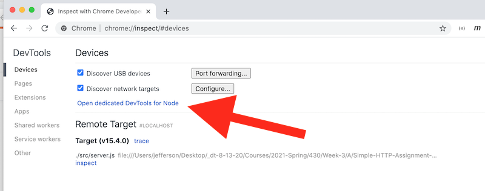

# Skill #10 - Debugging Node

## I. Overview 

- Let's learn how to *debug* our Node.js code (e.g. set breakpoints, step through code, watch variables etc)!

## II. Watch the Video
- The video for this lecture, which walks through the notes, is here --> [Essential Skills - Part X (05:40)](https://video.rit.edu/Watch/430-essential-skills-10)
- Here is the PDF I will be walking through --> [Debugging_Node.pdf](_files/Debugging_Node.pdf)
- Follow along, using your **first-web-service** code from last time

- ***Not mentioned in the video - for the BEST debugging experience with Node.js - click the "Open dedicated DevTools for Node" link, rather than the "inspect" link :***

## III. Homework
- Take a screenshot of your console, that shows you starting the debug session with `node --inspect ./src/index.js`
- In Chrome, fire up `chrome://inspect`, and then open up another browser tab and head to `http://localhost:3000/random-number`
  - take a screenshot of the Chrome debugger window (under the "Sources" tab of the `chrome://inspect` window) that shows an "active" breakpoint in your `onRequest` handler code of **index.js**
  - be sure that we can see the current value of the `pathname` variable in the debugger
- Post both screenshots to the myCourses dropbox

| <-- Previous Unit | Home | Next Unit -->
| --- | --- | --- 
|   [Skill #9 - Continuous Integration with CircleCI](9-continuous-integration.md) |  [**IGME-430**](../) | [Skill #11 - Creating CommonJS Code Modules](11-creating-commonjs-code-modules.md)
