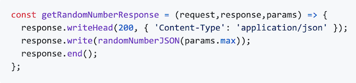
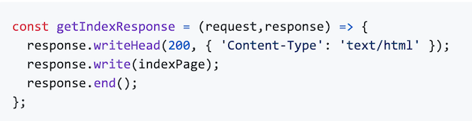
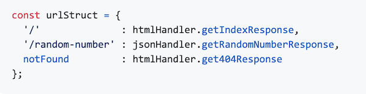
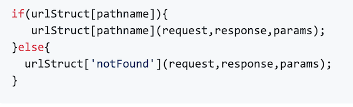

# Skill #11 - Creating CommonJS Code Modules

## 0. Watch the Video
- The video for this lecture, which walks through the notes, is here --> [Essential Skills - Part XI (11:36)](https://video.rit.edu/Watch/430-essential-skills-11)
- Follow along, using your **first-web-service** code from last time

## I. Overview 

- Today we are going to do some substantial "clean up" on our code by:
  - grouping the code into *logical* units (modules, i.e. external files)
  - getting rid of the `if` statements that route the responses in `onRequest()`, and instead utilize a *dispatch table*

## II. Creating our own code modules

### II-A. Get Started

- Go ahead and `git clone <url>` your **first-web-service** repository:
  - `cd` into it, and `npm i` to download all your dependencies
  - `npm run nodemon` to boot up the server
  - head to `http://localhost:3000/` to be sure that the app functions as before
  - now let's start refactoring this code!

### II-B. Create the jsonResponses.js module

- Create a new file named in the **src** directory named **jsonResponses.js**, and move the following code into it:
  - `const getRandomNumberJSON = ...`
  - \*\*IMPORTANT: rename this function to `randomNumberJSON` \*\*

### II-C.  Create a response handling function

- Add the following *response handler* to **jsonResponses.js**

- Note that this is similar code to handle the `/random-number` endpoint what we have over in **index.js**, except:
  - that `params` is an object that is getting passed in
  - and we need to grab the `max` property from params and pass that to our `randomNumberJSON()` helper function so that it functions as before

### II-D.  Create a *public interface* for the **jsonResponses.js** module

- We need to make the  `getRandomNumberResponse()` function "public" (i.e. *visible*) outside of this file
- The ` randomNumberJSON()` function can stay "private"
- Here's the code to do so - add it to the bottom of **jsonResponses.js**:
  - `module.exports.getRandomNumberResponse = getRandomNumberResponse;`
 
**Common JS Modules:**

- This is a module syntax known as [CommonJS](https://nodejs.org/api/modules.html#modules_module_exports):
  - This is an *older* module syntax than the ES6 Module syntax we used in 330
  - Does Node.js have access to ES6 module syntax? YES
  - So why are we still using this older syntax?
    - as of this writing, not all Node.js libraries support the newer syntax
    - the vast majority of existing Node projects still use the older CommomJS syntax - so it is good to know!

### II-E.  "Import" the *jsonResponses.js* module

- Over in **index.js**, add the following line of code to the top of the file:
  - `const jsonHandler = require('./jsonResponses.js')`

### II-F.  Use the module 
- In `onRequest()`, replace the 3 lines of "response" code in the `else if (pathname === '/random-number') {` block with:
  - `jsonHandler.getRandomNumberResponse(request,response,params);`
  - the above code will call the `getRandomNumberResponse()` function over in **jsonResponses.js**, and pass in the 3 parameters it needs

### II-G.  Test it
- If you have running `nodemon` (as we asked you to at the beginning, when you first tested the app), you have probably noticed that the app has been rebuilding and crashing as you made changes, this is normal!
- But once you save the last line of new code above it should be running correctly
- Head to the browser and test these endpoints, everything should work as before:
  - http://localhost:3000/
  - http://localhost:3000/random-number
  - http://localhost:3000/random-number?max=10000
  - http://localhost:3000/fake-file-name

 

## III. Create the htmlResponses.js module
- Now let's look at moving our HTML responses to a separate file (i.e. module)

### III-A. Create the htmlResponses.js module
- Create a new file named **htmlResponses.js** (in the **src** folder, obviously), and move the following code (found in **index.js**) into it:
  - `const indexPage = ...`
  - `const errorPage = ...`
  

### III-B. Create the "index response" function

- Note that we do not have a `params` parameter like in `getRandomNumberResponse(request,response,params)`, as we don't need one because we are not apssing any parameters to the index page

### III-C. Create a *public interface* for the **htmlResponses.js** module
- so we don't need to export `indexPage` or `errorPage`, but we do need to export `getIndexResponse`
- to the bottom of **htmlResponses.js** add:
  - `module.exports.getIndexResponse = getIndexResponse;`

### III-D. "Import" the htmlResponses.js module
- Over in **index.js**, go ahead and `require()` **htmlResponses.js** like we did with **jsonResponses.js** -and name this import `htmlHandler`

### III-E. Use the *htmlResponses* module 
- In `onRequest()`, replace the 3 lines of "response" code with a call to `getIndexResponse()` - and don't forget to pass over the `request` and `response` parameters

### III-F. Test it!

- Head to the browser and test these endpoints, everything should work as before, except the last link (the 404 page), which will cause a crash:
  - http://localhost:3000/
  - http://localhost:3000/random-number
  - http://localhost:3000/random-number?max=10000
  - http://localhost:3000/fake-file-name

### III-G. Get the `404` page working

- Over in **htmlResponses.js**, name the function `get404Response()`
- Move the appropriate code over from `onRequest()` 
- export it, of course
- in **index.js**, use it in the right place in `onRequest()`
- once everything is working, move on

## IV. One last thing, a dispatch table
- here, our *dispatch table* will be a table of references to functions or methods
  - https://en.wikipedia.org/wiki/Dispatch_table
- we are going to store our response functions in a table, and then call them from `onRequest()`
- this will significantly clean up and simplify our code
- it will also make it much easier to add more endpoints and response handler in the future

### IV-A. The dispatch table

- Here it is - add it to **index.js**
- As you can see, it's an object literal with:
  - *properties* that are strings
  - and *values* that are references to functions

### IV-B. Using the dispatch table

- in `onRequest()`, delete all of the "if" code
- add the following:

- test the app - all 4 links above - it should function as expected!

#### IV-B-i. How this works
- the `if` statement looks to see if there is a property named `pathname`
- if there is, go ahead and execute the referenced function in the dispatch table, and also pass in all 3 parameters (the HTML response handlers will ignore the extra `params` argument)
- if there is NOT a property named `pathname` (for example, if a web client requested a non-existant page), then call the `notFound` handler, which is `htmlHandler.get404Response`

## VI. Code Quality
- Run `npm test` and fix and errors you have (warnings are OK)
- Commit the code (`git add`, `git commit`), and `git push` it to your remote repository
- Test the app on Heroku 
- Be sure that CircleCI passed (look for the green checkmark on the GitHub page)

## VII. Submission
- In the mycourses dropbox:
  - ZIP and POST the updated **first-web-service** folder (don't forget to delete the **node_modules** folder prior to zipping!)
- In the comments field of the dropbox, type:
  - the URL to your GitHub repository
    - we are also looking for the green checkmark that shows your CircleCI tests have passed
    - the working URL to your functional `abc1234-first-web-service` page on Heroku - just the link to the main page is fine
  - IMPORTANT - DO NOT post your Heroku control panel link - no one but you can see that page
  

| <-- Previous Unit | Home | Next Unit -->
| --- | --- | --- 
|   [Skill #10 - Debugging Node](10-debugging-node.md) |  [**IGME-430**](../) | [Skill #12 - "Serving" a Rich Client Page](12-serving-rich-client-and-ajax.md)
