# Skill #2  - GitHub and Heroku

## 0. Video & HW

- The video for this lecture, which walks through the notes and adds a few details, is here --> [Essential Skills - Part II (08:14)](https://video.rit.edu/Watch/430-essential-skills-2)
- See the HW assignment at the bottom of the page (Part VII.)

## I. Overview

- We are going to post the **random-jokes.php** code from last time and deploy it to Heroku
- What is Heroku? It is a cloud ["platform as service" (PaaS)](https://en.wikipedia.org/wiki/Platform_as_a_service) environment where developers can host applications written in Java, JavaScript, PHP and other languages
- Heroku is where we will hosting our apps for the rest of the semester
- Unlike banjo (a Unix server), where we have acccess to the file system and use FTP to transfer files, we will instead upload files to Heroku via specific GitHub repositories

## II. Create a Heroku account

- Head here to create a Heroku account --> https://signup.heroku.com/
  - it's free!
  - if you give them a credit card number to verify your identity, you can get a few more free benefits, including the ability to host more apps. It's very easy to set up your account so that you will never get charged anything

## III. Create a Heroku App

- A) Head to the Heroku Dashboard and click on the "New" and then "Create New App" buttons
  

 

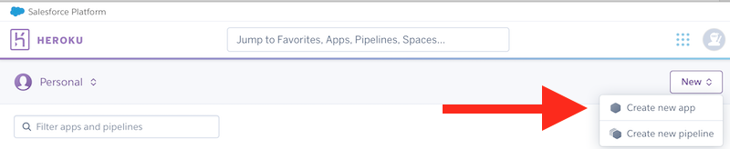

- B) Heroku apps need to have a globally unique name - name the app `abc1234-random-jokes` (where `abc1234` is your ID, which should be unique):
  - Then click the "Create app" button

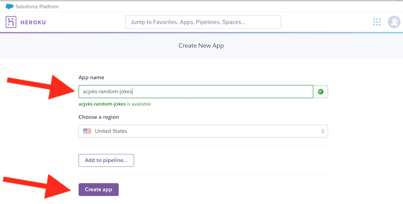

- C) You should now be on the "Deploy" tab of this app:
  - Note that the bottom arrow points at a "Connect to GitHub" button - GitHub is where we will need to post the PHP file that we want to upload to here - we'll handle that in a second

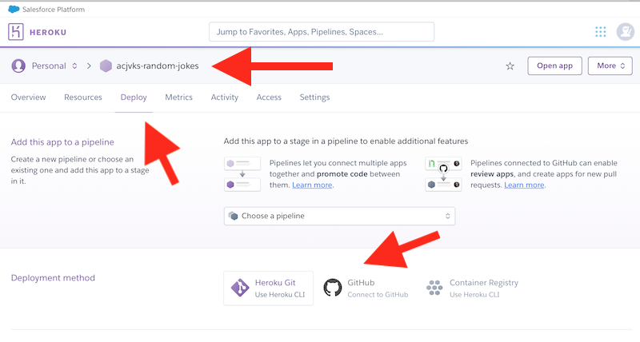

- D) For now, just verify that the app works by clicking the "Open App" button, which will give you the following default Heroku page in a new browser window

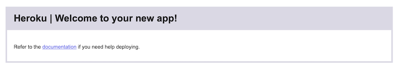

 
## IV. Set up a GitHub repository

- A) Head to github at https://github.com/ and login
  - Create a new repository named `random-jokes-php-heroku`

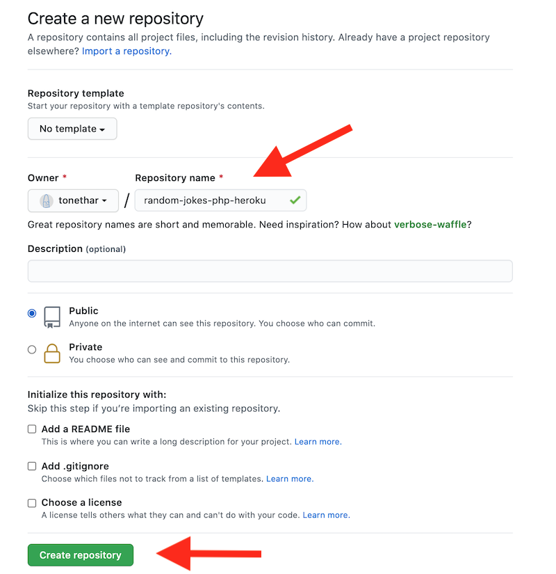

- B) Click the "Creating a new file" link

- C) Name the file **index.php**:
  - copy and paste the **random-jokes.php** code into the file
  - save the file by clicking the "Commit new file" button

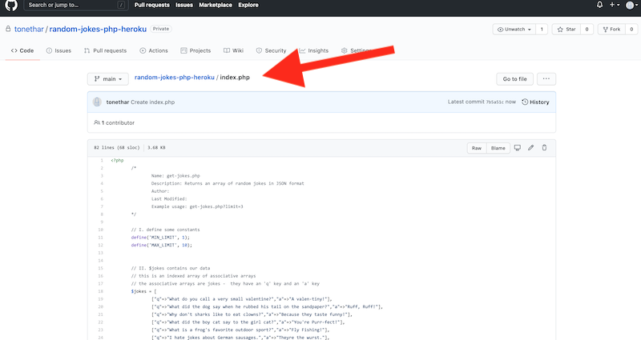

## V. Linking your Heroku App to the GitHub repository

- A) Easy! 
  - Just head back to Heroku control panel, choose your app, and head to the Deploy tab
  - Then click the "GitHub - Connect to GitHub" button in the "Deployment method" section of the page
  - Then search for your respository
  - Then click the "Connect" button

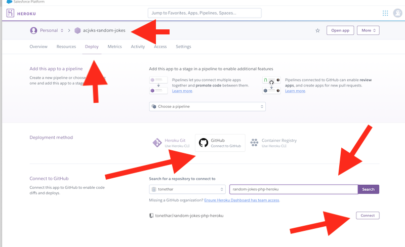

- B) You should have successfully connected your GitHub repository to this Heroku project:
  - one last thing to do! Click the "Enable Automatic Deploys" button
  - this will make it so whenever you modify your GitHub repository, your code changes will *automatically* be pushed to Heroku

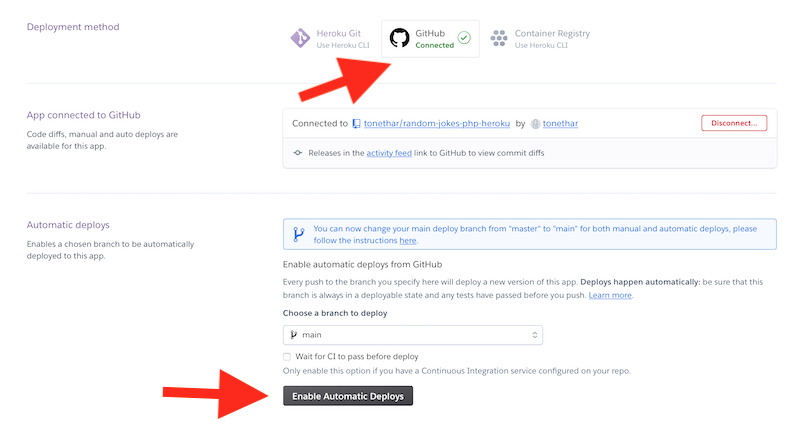

- C) To upload the app (you'll only have to do this once because you enabled automatic deploys) - click the "Deploy Branch" button
  - after a few seconds, your app should be uploaded and you will see the "Your App was successfully deployed" message at the bottom of the screen

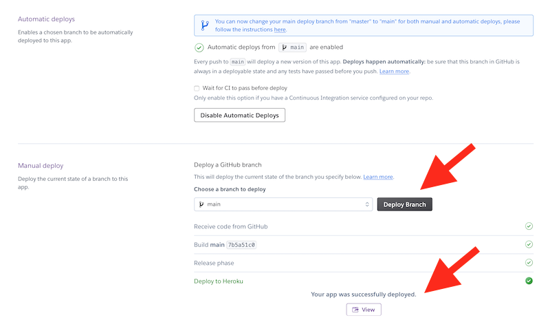

 - D) Now click on the "Open app" button, you should see that your app was deployed to the web!
   - the URL in the location box (yours will be slightly different from mine) is the URL you will be posting to the dropbox in a little bit
 

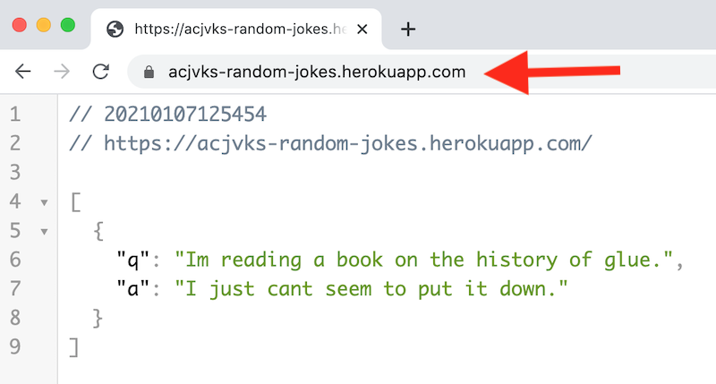

## VI. Updating your GitHub repository

- Go ahead and update the PHP code in your repository - make a small change - for example I added triple `!!!` to the end of every punchline. *Be careful not to "break" the PHP code! Consider first testing your changes on banjo to be sure that they work*
- Click the "Commit changes" button
- If you head to the "Activity" tab of your project in Heroku, you will see that this new version is uploading
- Once that's done, reload the URL to the actual joke page, it will take 5 or 10 seconds to reboot the "dyno", and then you will see the changes!

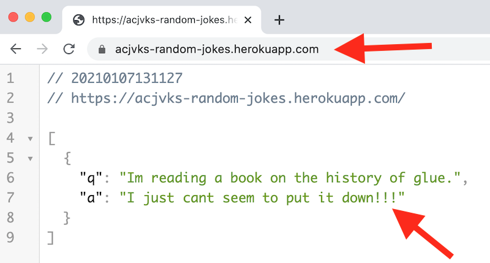

## VII. Submission
- In the myCourses dropbox, ZIP and Post your repository (the **index.php** file)
- In the comments field of the dropbox, type:
  - the URL to your GitHub repository
  - the URL to your working random jokes page on Heroku (IMPORTANT - DO NOT post your Heroku control panel link - no one but you can see that page)
  - tell us what changes you made to the **index.php** file

| <-- Previous Unit | Home | Next Unit -->
| --- | --- | --- 
|   [Skill #1 - Client Tools and the HTTP Protocol](1-client-tools-and-http-protocol.md) |  [**IGME-430**](../) | [**Skill #3 - Command-line Git & Cloning Repositories**](3-command-line-git.md)
