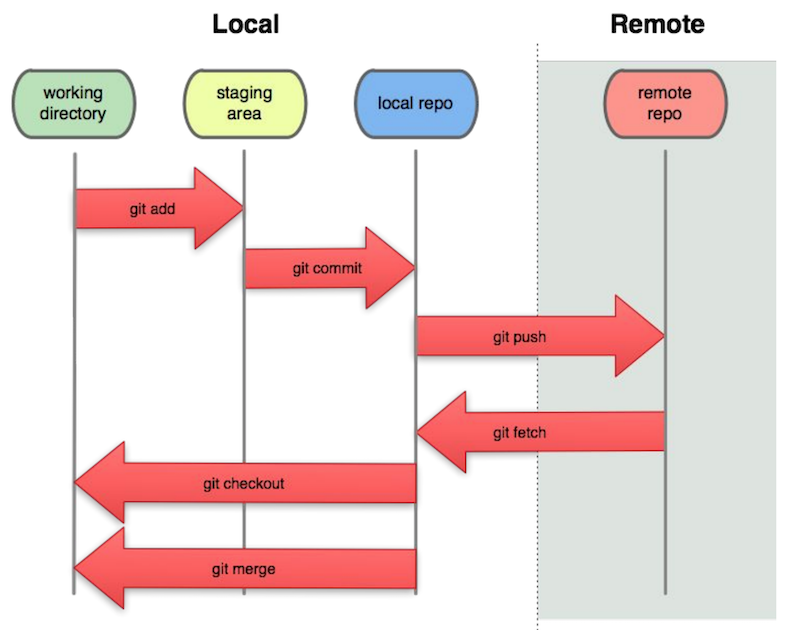

# Skill #3 - Command-line Git & Cloning Repositories

## 0. Video & HW

- The video for this lecture, which walks through the notes and adds many details, is here --> [Essential Skills - Part III (15:53)](https://video.rit.edu/Watch/430-essential-skills-3)
- ***You may have gotten away with NOT watching the previous 2 videos, but you will probably need to watch this one!***
- See the HW assignment at the bottom of the page (Part IV.)

## I. Recap & Overview

- Last time we learned how to deploy a PHP file to Heroku, and then connect it to a GitHub repository
- We also saw how we can make changes to that PHP file utilizing GitHub's web interface, and that these changes would be propigated to Heroku automatically (so long as we have clicked the "Enable Automatic Deploys" button in Heroku's control panel)
- Editing a file in GitHub is fine if you only have one or two small changes to make, but it's not practical if you are actively working on a code project
- Instead, we are going to review:
  - how to `clone` a *remote* GitHub repository (i.e. download a local copy of it to our PC's hard drive)
  - how to make changes to this local respository
  - how to commit these changes and `push` them back to the remote repository

## II. GitBash

- To get this done, you will need to have command line Git installed on your system, as well as a Unix Terminal emulator
- If you have a Mac:
  - you already have the Terminal application
  - head here for instructions for installing to Mac OS (note: if you have Xcode installed, then Git is already on your machine): https://git-scm.com/book/en/v2/Getting-Started-Installing-Git
- Windows:
  - Git for Windows - https://gitforwindows.org - will install both GitBash (a terminal emulator) and command line git for you

## III. Demo

- We'll be demoing these activities in the video
- Below are some of the commands we'll be using in the demo

### III-A. Unix Commands

- `cd dirName` - will change the *current working directory* to *dirName*. The current working directory is the directory we are "in" - it is where any typed in unix commands will be executed. **We will call the current working directory *cwd* below**
- `cd ..` - moves the *cwd* "up" one level into the parent directory of the folder
- `cd` - by itself, will change the *cwd* to the user's login (i.e. home) directory
- `pwd` - prints out the current path to the *cwd*
- `ls` - lists out files and directories in the *cwd*
- `ls -al` - lists out files and directories in the *cwd*, including "invisible" (those files whose name begins with a dot)
- `mkdir dirName` - will create a new folder named *dirName*
- `touch fileName` - will create an empty file named *fileName*
- `rm fileName` - will delete *fileName*
- `rmdir dirName` - will delete the folder named *dirName*
- `mv file1 file2` - will rename *file1* to *file2*
- `cp file2 file3` - will make a copy of *file2* that is named *file3*
- `chmod` - used to set file permissions
- `sudo` - used to perform commands (such as installing files in system directories) as the "super user"
- `nano` (or `pico`) - a simple text editor
- `clear` - clear the screen

**Handy Unix Command-line tips**
- *ctrl-a* - to move the cursor to the *beginning* of the line
- *ctrl-e* - to move the cursor to the *end* of the line
- *up arrow* - to view previously typed commands (continue pressing up arrow to cycle through command history, the down arrow goes forward through the history)
- *tab key* - for autocompletion of partially typed file names
- *drag and drop* files into GitBash (or Terminal) to have their file paths typed for you

### III-B. Git Commands

- `git --version` - will tell you that `git` is installed
- `git clone <url>` - will clone the remote repository at `<url>` to the *cwd* - https://git-scm.com/docs/git-clone
- `git status` - shows the current status of the repository (files that have changed, pending commits, ...) - https://git-scm.com/docs/git-status
- `git add` - adds local repository files to the *staging area* - see below - https://git-scm.com/docs/git-add
- `git commit -m "message"` - commits files in the staging area to the local repository files - see below - https://git-scm.com/docs/git-commit
- `git push`- pushes the changes to the local repository up to the remote repository - https://git-scm.com/docs/git-push
- `git remote update` - will update all of your branches set to track remote ones, but not merge any changes in. This is useful when you want to check if the remote repository has changed - https://git-scm.com/docs/git-remote
- `git pull`- will update and merge any remote changes (of the current branch you're on) to your local repository - https://git-scm.com/docs/git-pull
- `git rm --cached fileName` - will remove *fileName* from version tracking, but not delete the file itself
- `git rm --f fileName` - will remove *fileName* from version tracking AND will delete the file

## IV. HW & Submission (Out of 10 points)
- Use the GitBash terminal emulator
- Create a local GitHub repository of your random joke repository by utilizing `git clone <url>`
- Make a change to the **index.php** file, such as changing `MAX_LIMIT`
- Here are the "big 4" git commands that you need to know:
  - Use `git add .` to add a file to the local repository's "staging area"
  - Use `git commit-m "message"` to commit it to the local repository
  - Use `git push` to push the changes to the remote repository
  - Use `git status` to be sure that your chnages and push was successful
- Take a screen shot of your entire session (the commands you typed above) and post it to myCourses
- Type the answers to these questions in the comments field of the dropbox (-1/2 point each for incorrect answers):

1. What does *cwd* stand for?

2. Which command is used to print out the *cwd*

3. What is the maximum number of *parent* directories a directory can have? 

4. What does `ls` do?

5. What does `ls -al` do?

6. In a "long list", how can you tell that a listed item is a directory or a file?

7. What character do "invisible" files begin with?

8. Write the unix command that will move the *cwd* "up" one level

9. Which command will clear the shell's screen? 

10. How do you get the shell to cycle through the previously typed in command history?

11. Which `git` command is used to download a *local copy* of a remote repository?

12. Which `git` command is used to print out the current *status* of the repository?

13. Which `git` command is used to add a file to the local repository's *staging area*?

14. Which `git` command is used to save the files in the *staging area* to the local repository?

15. Which `git` command is used to save the changes made to the local repository, to the remote repository?
  
  

| <-- Previous Unit | Home | Next Unit -->
| --- | --- | --- 
|   [Skill #2 - GitHub and Heroku](2-github-and-heroku.md) |  [**IGME-430**](../) | [Skill #4 - Hello Node](4-hello-node.md)
