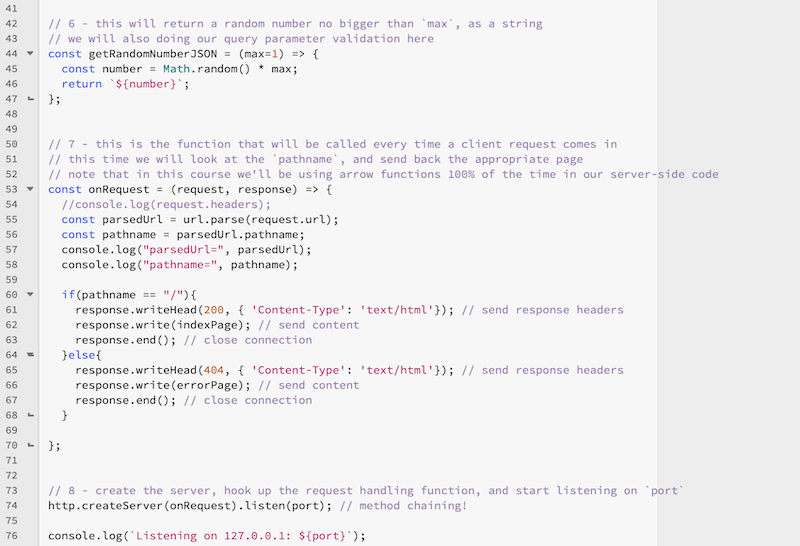
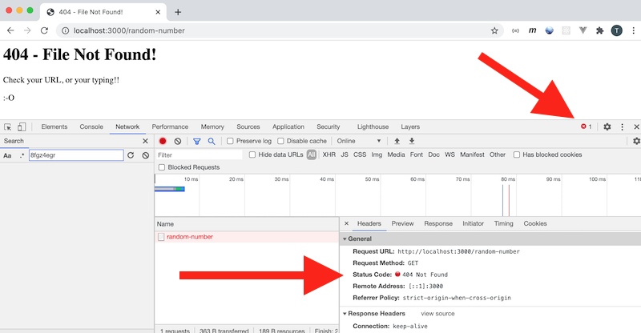
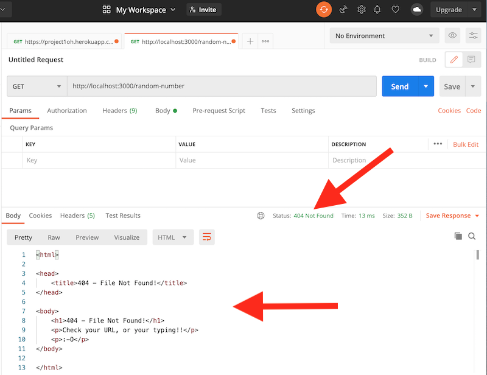
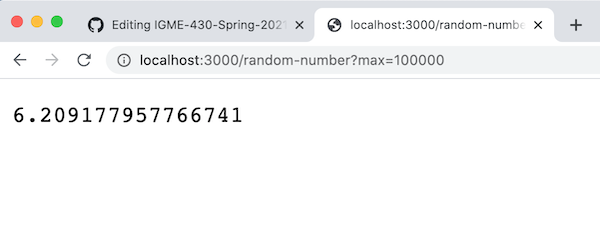
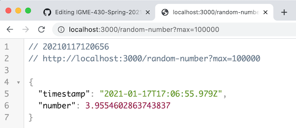
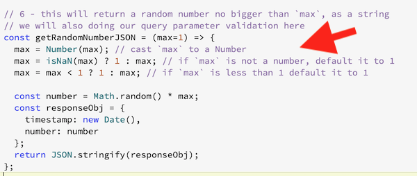

# Skill #6 - First Node Web Service

- Today we will learn how to build a simple [*web service*](https://www.tutorialspoint.com/webservices/what_are_web_services.htm) using Node.js, and how to pass parameters to it:
  - Recall that a *web service* generally returns *data* formatted in a specific format (usually JSON or XML), as opposed to an entire *web page*:
    - an example of a *web page* is http://www.rit.edu
    - and example of a *web service* is http://igm.rit.edu/~acjvks/courses/shared/430/php/get-jokes.php?limit=5

## I. Overview

### I-A. Better code (slightly)

- The simple web server we created last time wasn't too special - it actually returned the SAME web page (*index*) for every request it received. This means that when the web browser also asked for a favicon, this web server also sent back the same *index* page, again! Good thing that the browser is smart enough to ignore that HTML and not instead try to create an image out of a web page!
- This time we'll actually look for the page that the client is looking for (using the `request.url`) property:
  - if the client requests a non-existent page, we'll return a "404 - file not found" page
- We will also look for *query parameters* - in this case one named `max` that will get passed in like this - `http://localhost:3000/get-random?max=10`

### I-B. New (to us) built-in Node.js modules
- Last time we will used the `http` module to help us build a simple web server
  - https://nodejs.org/api/http.html
- This time we will also use, so that we can get `pathname` and *query parameters* from the URL: 
  - https://nodejs.org/api/url.html
  - https://nodejs.org/dist/latest-v14.x/docs/api/querystring.html

<hr>

## II. Web service starter code
- This web service will be really exciting - and will return a random number between `0` and `max` (`max` being a query parameter that is passed in)
- We won't set up the actual web service at first, instead we will create and "serve" two HTML web pages:
  - the HTML "landing page" (the default page when the client opens up the default URL with nothing else in the path i.e. `/`
    - we will also send the status code of `200`, `Success`
  - the HTML "file not found" page that is returned when the client asks for any other path or file:
    - we will also send the status code of `404`, `Not Found`
- Let's get started! First, set up the project:
  - Create a folder named **first-web-service**
  - Using a terminal program (GitBash/Powershell/Terminal) make that folder the *cwd* by `cd`ing into it
  - `npm init -y` - let's use the default values this time
  - Edit the **package.json** file:
    - under the `"scripts"` key add a `"start"` key with the value of `node ./src/index.js`
  - In the **first-web-service** folder, create a **src** folder
  - Create **index.js** and put it in the **src** folder
    - in **index.js**, add this line of code `console.log("First web service starting up ...");`
    - in the console, type `npm start` to run your script to make sure that everything is working
  - To complete **index.js**, Copy/Paste the comments and code below, then type in the rest:
   
**index.js**

```js
console.log("First web service starting up ...");

// 1 - pull in the HTTP server module


// 2 - pull in URL and query modules (for URL parsing)


// 3 - locally this will be 3000, on Heroku it will be assigned
const port = process.env.PORT || process.env.NODE_PORT || 3000;

// 4 - here's our index page
const indexPage = `
<html>
  <head>
    <title>Random Number Web Service</title>
  </head>
  <body>
    <h1>Random Number Web Service</h1>
    <p>
      Random Number Web Service - the endpoint is here --> 
      <a href="/random-number">random-number</a> or <a href="/random-number?max=10">random-number?max=10</a>
    </p>
  </body>
</html>`;

// 5 - here's our 404 page


// 6 - this will return a random number no bigger than `max`, as a string
// we will also doing our query parameter validation here


// 7 - this is the function that will be called every time a client request comes in
// this time we will look at the `pathname`, and send back the appropriate page
// note that in this course we'll be using arrow functions 100% of the time in our server-side code
const onRequest = (request, response) => {
  //console.log(request.headers);
 
 
  console.log("parsedUrl=", parsedUrl);
  console.log("pathname=", pathname);
   
};


// 8 - create the server, hook up the request handling function, and start listening on `port`

console.log(`Listening on 127.0.0.1: ${port}`);
```

<hr>




<hr>

## III. Test it

- `npm start` (and fix your typing errors as neccessary)
- Head to `http://localhost:3000` - you should see the following:

<hr> 


  
<hr>

- Clicking on either landing page link, or typing in any other path name or file will produce the error page
- Also look in browser console - `GET http://localhost:3000/random-number 404 (Not Found)`  - and in the Network inspector to see the error code (don't forget that you need to reload the page AFTER the dubugger is open in order to see the latter)
- Who sent that error (status) code? WE DID! In the `else` of `onRequest`

<hr> 


  
<hr>

- Don't forget that we can use also use Postman to inspect the web server output 

<hr> 


  
<hr>

## IV. Implementing the `/random-number` endpoint 

- Now let's get the `/random-number` endpoint working - this is the *web service* part of our project
- Try to figure it out on your own - here are some tips - we'll also walk through the entire process of getting this working on the video (linked above):
  - don't forget that you need to reboot your server to see the code changes - by pressing **control-C** on your keyboard
  - modify `getRandomNumberJSON()` so that it return a number between `0` and `max`
    - don't worry about making the web server return JSON yet
  - now add an `else` statement to `onRequest`, and whenever the `path-name` is equal to `random-number`, call `getRandomNumberJSON()` and send that value back to the client in `response.write()`
    - and don't worry about the `max` parameter yet!
  - make the `content-type` `text/plain` for now
 - now head to `http://localhost:3000/random-number` - you should see something like this (the number will vary of course)
  
 <hr> 


  
<hr>

- Watch the video to see how to format the number as JSON - it should look like this when you are done

 <hr> 


  
<hr>

## V. Accessing the `max` parameter 


### V-A. Grab the value of the `max` parameter
- To grab the query parameter of `max` and use it, we are now going to use node's `querystring` module that we required earlier (as `query`)
- Add the following to `onRequest`, and then check the console to see what you get back:

```js
const params = query.parse(parsedUrl.query);
const max = params.max;
console.log("params=", params);
console.log("max=", max);
```

### V-B. Use the value of `max`

- First, in `onRequest`, pass `max` to `getRandomNumberJSON()`
- In `getRandomNumberJSON()`, write some code to *validate* what is getting passed in see below:

<hr>



<hr>

### V-C. Test it!


<hr><hr>

| <-- Previous Unit | Home | Next Unit -->
| --- | --- | --- 
|   [Skill #5 - First Node Web Server](5-first-node-web-server.md) |  [**IGME-430**](../) | [Skill #7 - Create Random Joke Web Service](7-create-random-joke-web-service.md)
