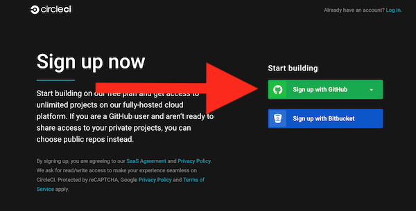
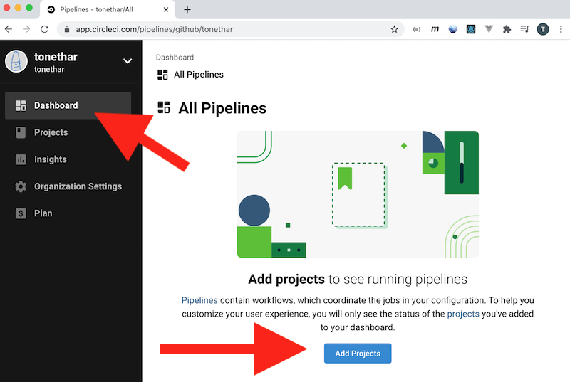
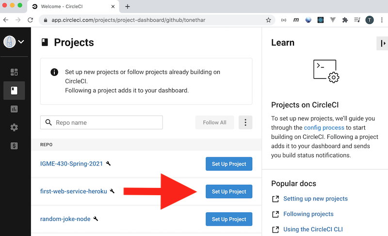
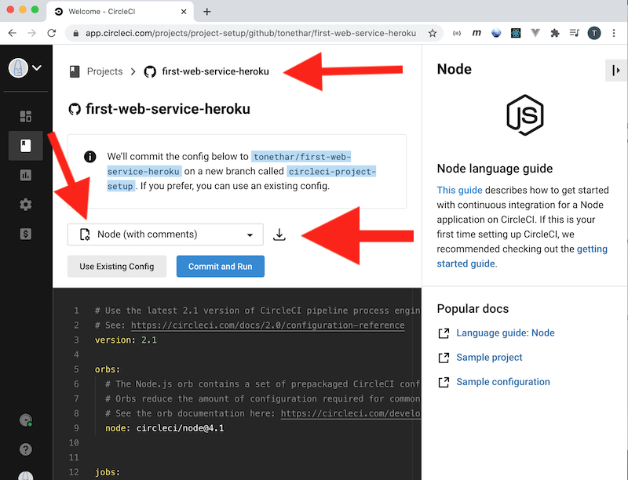
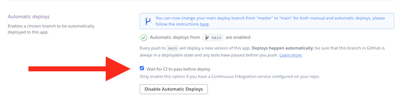
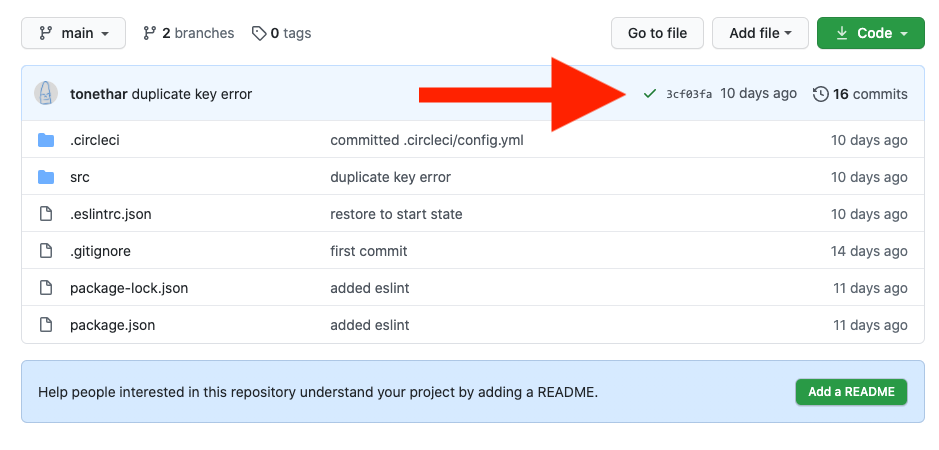

# Skill #9 - *Continuous Integration* with CircleCI

## 0. Video & HW
- The video for this lecture, which walks through the notes, is here - [Essential Skills - Part IX. (09:24)](https://video.rit.edu/Watch/430-essential-skills-9)
- See the HW assignment at the bottom of the page (Part IV.)

<hr>

## I. Overview
- CircleCI is a cloud service that will *automatically* test your code whenever a change is committed to GitHub
  - This means that CircleCI will run our `npm test` script every time we push to GitHub, and email us if it fails
- What is *Continuous Integration* ?
  - "Integrating" (merging code branches) "hurts" - and because it hurts - we should do it more often (rather than less often) and ultimately it will end up hurting *less* over the long run
  - [YouTube - IBM Cloud - What is Continuous Integration? (6:20)](https://www.youtube.com/watch?v=1er2cjUq1UI)
  - [YouTube - IBM Cloud - What is Continuous Delivery? (5:50)](https://www.youtube.com/watch?v=2TTU5BB-k9U)
  - [YouTube - IBM Cloud - Continuous Deployment vs Continuous Delivery (5:34)](https://www.youtube.com/watch?v=LNLKZ4Rvk8w)

<hr>

## II. Setting up CIrcleCI on a project

### II-A. Clone your start code
- We are going to be setting up a CircleCI project that will run tests for us every time we commit a project to GitHub
- Our starter code from today will be the repository we created the `npm test` script for last time - which is **first-web-service** (or **first-web-service-heroku**, or whatever you called it)
- Go ahead and `git clone <url>` this repository to a folder on your hard drive
- `cd` into the **first-web-service-heroku** folder and make it the *cwd*
- Type `npm i` to download the packages listed under "devDependencies" in **package.json**
- Type `npm test` and verify that the test runs and passes (*passing* means there are no errors, but warnings are acceptable)
- Type `npm run nodemon` and verify that the app still functions

### II-B. Set up a CircleCI account

- Sign up for a CircleCI account (using your GitHub account for login credentials) here:
  - https://circleci.com/signup/

<hr>



<hr>

### II-C. Create a CircleCI project

- Head to the Dashboard and click the "Add Project" button

<hr>



<hr>

- Then locate your GitHub repository in the **Repo** list and click the "Set Up Project" button

<hr>



<hr>

- You have now successfully created a CircleCI project! (see screenshot below)
- Now go ahead and download the configuration file by clicking the download button (or you can copy/paste this configuration file directly from the bottom of the page if you wish) - then take a look at the **config.yml** configuration file:
  - It is written in YAML:
    - https://yaml.org/
    - https://blog.stackpath.com/yaml/
  - It has property that looks something like this `node: circleci/node@4.1`
  - This is an "orb"  - this one being a common pre-set for node projects:
    - https://circleci.com/docs/2.0/orb-intro
    - https://circleci.com/developer/orbs/orb/circleci/node
  - If you look under `jobs` and `build-and-test`, you will see the following
  
  ```
  - run:
      name: Run tests
      command: npm test
  ```
  
  - You can see that the `build-and-test` "job" means that our `npm test` script will be run 
  - And down in `workflows` is where the `build-and-test` job is actually told to run

<hr>



<hr>

### II-D. Commit the config file

- In your **first-web-service** folder, create a new folder named **.circleci**, put the **config.yml** file that you downloaded into it
- Commit this file (and folder) to your repo:
  - `git status`
  - `git add .`
  - `git commit -m "committed .circleci/config.yml"`
  - `git push`

<hr>

### II-E. Head to the CircleCI Dashboard

- You should now be able to see the test running on the CIrcleCI dashboard (you might have to click the "Use existing config" button)
  - If the test passes - head to your **first-web-service** GitHub repository and look for the green checkmark that shows that the test passed. Click on that checkmark to jump to the project on CircleCI
  - If you get an error about "No one is following the project" - be sure to click the "Follow Project" button and try again
- To see what a CircleCI error looks like, go ahead and modify **src/index.js** so that it fails `npm test` and then commit/push your changes to the remote repository
  - CircleCI will also send you an email about the failure!
 
<hr>

## III. HW and Submission

- One thing that was not mentioned in the video is that Heroku can be configured so that automatic deployments from GitHub are ONLY allowed when the CircleCI tests PASS
- Do this: Head to Heroku (the "Deploy" tab) and turn this option "on" for this project

<hr>



<hr>


- In the mycourses dropbox:
  - ZIP and POST the updated **first-web-service** folder
  - Post a screenshot of your Heroku project panel (the "Deploy" tab) that shows you have checked the "Wait for CI to pass before deploy" checkbox
- In the comments field of the dropbox, type:
  - the URL to your GitHub repository (we are looking for the green checkmark that shows your tests have passed - see screenshot below)
  - the working URL to your functional `abc1234-first-web-service` page on Heroku - just the main page this time
  - IMPORTANT - DO NOT post your Heroku control panel link - no one but you can see that page
  
  <hr>



<hr><hr>

| <-- Previous Unit | Home | Next Unit -->
| --- | --- | --- 
|   [Skill #8 - Adding developer "tooling"](8-add-developer-tooling.md) |  [**IGME-430**](../) | [Skill #10 - Debugging Node](10-debugging-node.md)
