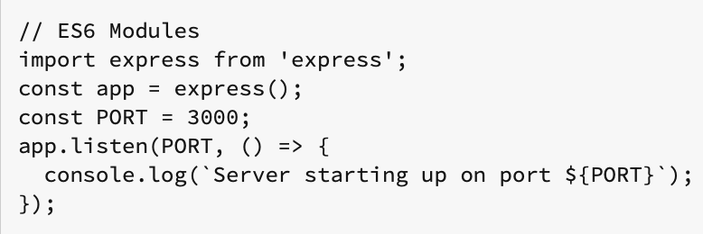

# Intro to express
- *Fast, unopinionated, minimalist web framework for node:*
  - https://www.npmjs.com/package/express
  - http://expressjs.com/
- Considered the defacto package for Node.js and apps that utilize HTTP, routing and server-side view rendering 
- Has easy hooks for *middleware*:
  - https://expressjs.com/en/guide/using-middleware.html
  - https://expressjs.com/en/resources/middleware.html

<hr>

## I. Set up project and tooling

1) Create a folder named **first-express-app** and `cd` into it

2) Install packages

    - `npm init -y`
    - `npm i express`
    - `npm i --save-dev nodemon`

3) Add the following to the "scripts" key of **package.json**
- `"nodemon": "nodemon --watch src src/server.js"`

4) Create a **src** folder for your program files

<hr>

## II. Start coding your express server

### II-A. Start Code

- Rather than CommonJS modules (`require()` & `module.exports`) like we used in Project 1, let's instead use ES6 modules (`import` & `export`)

**src/server.js**



- Now run the app with `npm run nodemon`
- ***FAIL!***

### II-B. Node uses CommonJS (CJS) modules by default
- You can tell Node.js to use ES6 modules by either:
  -  changing the file extension of the JS files from `.js` to `.mjs` OR
  -  adding a `"type": "module"` key to **package.json** (we will do it this way)

<hr>

## III. Create some hard-coded data

- You can get some fake JSON data from https://www.mockaroo.com/
- Just use the `id`, `first_name` & `last_name` fields - delete the others
- Now export the JSON - 50 or 100 records is enough
- We will store this hard-coded data as just a regular JS array of object literals
- Create **src/data/user-data.js** file:

```js
const users = [{
  "id": 1,
  "first_name": "Jere",
  "last_name": "Reay"
},...];

// default export
export default users
```

- make sure that the **data** folder is inside the **src** folder
- note we are doing an ES6 `export default` at then end

<hr>

## IV. Make sure that the data is loaded

- Add the following to **src/server.js**

```js
// default ES6 import
import users from './data/user-data.js';

...

console.log(users);
```

- Test it - the `users` array should log out

<hr>

## V. Create some `GET` routes

<hr>

## VI. Create some `POST`, `PUT`, and `DELETE` routes

<hr>

## VII. Create a `GET` endpoint `/all-users`

<hr>

## VIII. Submission


<hr><hr>
