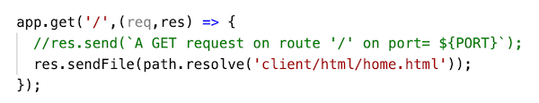
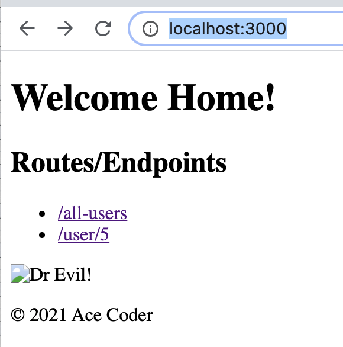
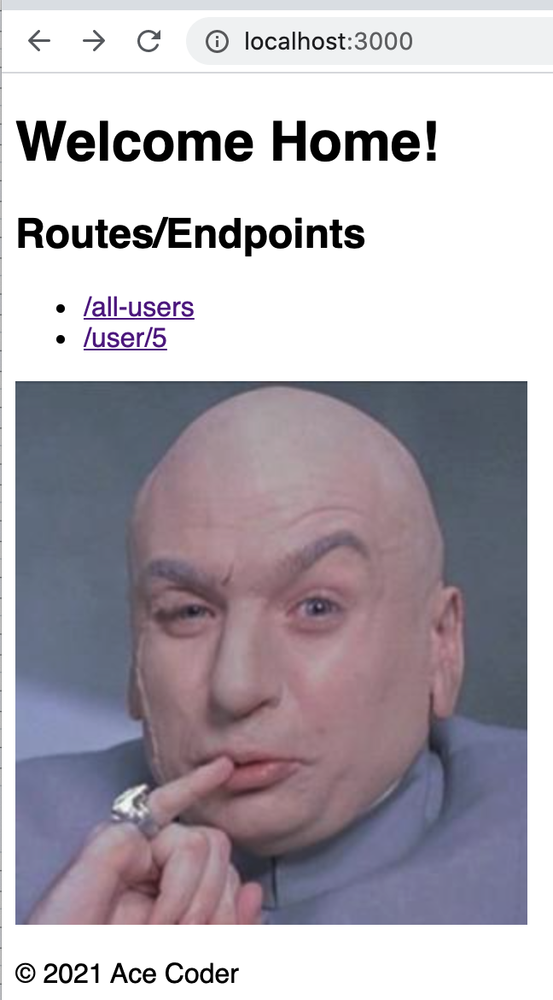

# 2 - Express - Serving Static Files

## I. Overview
 - Here we will see how to use a built-in express middleware function called "express static":
   - https://expressjs.com/en/4x/api.html#express.static
 - This can "serve" (i.e. "send") static files for us, so that we don't have to write the file loading and endpoint handing code ourselves
 - Note: a *static* file is one that doesn't change between server calls - examples include images, CSS files, JavaScript files, and some HTML files
 - PS - there's no video for this, and it shouldn't take you too long

<hr>

## II. Start Files

- The "static" start files that you will be "serving" for this exercise are here --> [client.zip](_files/client.zip):
  - **client/html/home.html**
  - **client/images/dr-evil.jpg**
  - **client/styles/default-styles.css**
- Unzip these and place the **client** folder inside of the **first-express-app** folder

<hr>

## III. Start coding using our first *middleware*
- Get the app running with `npm run nodemon` and make sure that everything still works
- Add this line of code to **server.js** and put it BEFORE  the first `app.get(...)` call:
  
  ```js
  // "public" folder, "source" folder
  app.use('/assets', express.static('client/'));
  ```

- The above line of code tells express to "serve" the above files in the **client** folder, and make them available at an **/assets** endpoint
- Reload the **http://localhost:3000/** endpoint - everything is the same as before - or is it?
  - Now check these URLs out in the browser:
    - http://localhost:3000/assets/images/dr-evil.jpg
    - http://localhost:3000/assets/styles/default-styles.css
    - http://localhost:3000/assets/html/home.html
  - All 3 of these files should load into a browser tab with no issues - note that the path now starts with **assets**
  - One issue though: the HTML page is not displaying the image, nor loading the stylesheet properly. You will fix this shortly
  - If you check the `content-type` in the Network inspector you will also see that these values are correct
  - WOW, pretty easy!

<hr>

## IV. Serve up `home.html` under the `/` endpoint

- To serve **home.html** as the default file (i.e. under **/**), we need to get the full path to **home.html**, and call `res.sendFile()`:
  - make `app.get('/',...)` look like this:



- You will also have to import `path` like this - `import path from 'path';`
- Head to `http://localhost:3000/` - **home.html** should load, but the image isn't showing, nor are styles being applied, it will look like this:




<hr>

## V. Fix the `home.html` page

- You will need to make 2 small edits to **home.html** to fix it (hint, look at the file paths in the `<link>` and `` tags). When you are done it should look like this:



<hr>

## VI. Submission

- Delete your **node_modules** folder, then ZIP and POST to the dropbox
- There is no need to post this to GitHub or Heroku


<hr><hr>

| <-- Previous Unit | Home | Next Unit -->
| --- | --- | --- 
|   [**Express #1 - Intro to express**](1-express-intro.md) |  [**IGME-430**](../README.md) | [**Express #3 - POST requests**](3-express-post-requests.md)
