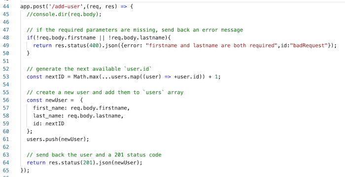

# 3 - Express - POST requests

## I. Overview

- Let's get POST request working and give our little app the ability to add new users
- To help us with this, there is some built in *middleware* to handle POST requests - `body-parser`:
  - http://expressjs.com/en/resources/middleware/body-parser.html
- PS there's not a video for this, and it shouldn't take you too long

<hr>

## II.  Create a HTML `<form>` page

- put the following in the **client/html/** folder

**add-user-form.html**
```html
<!DOCTYPE html>
<html lang="en">
  <head>
    <meta charset="utf-8" />
    <title>Add a user</title>
  </head>
  <body>
    <header>
      <h1>Add a user!</h1>
    </header>
    <main>
      <form action="/add-user" method="POST">
        First name:
        <input type="text" name="firstname" value="">
        Last name:
        <input type="text" name="lastname" value="">
        <input type="submit" value="Submit">
      </form>
    </main>
    <footer>
      <p>&copy; 2021 Ace Coder</p>
    </footer>
  </body>
</html>
```

- now head to `http://localhost:3000/assets/html/add-user-form.html` - the form should be visible because of `express.static()` serving it for us:
  - although that's a clunky endpoint!
- so let's serve it on **'/add-user-form.html'** instead:
  - head to **server.js** and add a `GET` endpoint - `app.get('/add-user-form.html', ...),`
  - then test it at `http://localhost:3000/add-user-form.html` to be sure you did it right

<hr>

## III. Create the `/add-user` `POST` endpoint

### III-A. Import the `body-parser` middleware
- When you look at the `<form>` tag above, you will see that the form's HTTP `method` is `POST`, and the `action` (the endpoint it calls when the submit button is clicked) is `/add-user`
- Now we need to tell express to use the `body-parser`  *middleware* to handle any POST data that is sent in the HTTP message body - add the following to **server.js**:

```js
import bodyParser from 'body-parser';
```

- and:

```js
app.use(bodyParser.urlencoded({extended: true}));
```

- and you should also download the `body-parser` files by typing `npm i body-parser`

<hr>

### III-B. Get the `/add-user` endpoint working

- Let's write some code for that endpoint:



- Test it!
  - You should now be able to add new users with the **/add-user-form.html** form (which calls the **/add-user** POST endpoint)
  - Confirm you were successful by heading to the **/all-users** endpoint

<hr>

## IV. Submission

- Delete your **node_modules** folder, then ZIP and POST to the dropbox
- There is no need to post this to GitHub or Heroku


<hr><hr>

| <-- Previous Unit | Home | Next Unit -->
| --- | --- | --- 
|   [**2 - Express - Serving Static Files**](2-express-serving-static-files.md) |  [**IGME-430**](../README.md) | **Express #4**
