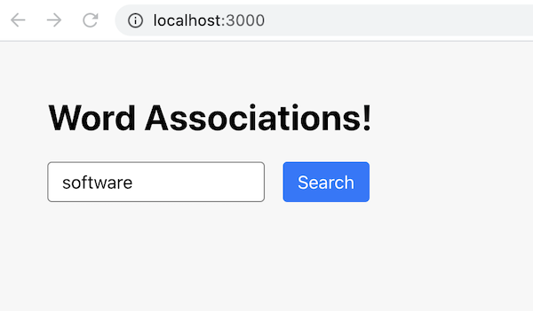

# HW - Create React App + Express


## Overview 

- In this exercise, we are going to see how to:
  - create a React client Application with [`create-react-app`](https://reactjs.org/docs/create-a-new-react-app.html)
  - connect this app to an [express](https://www.npmjs.com/package/express) server - this server acts as a *proxy* and will download the contents of a "word association" web service for us
  - post the completed app to Heroko - it will run both locally AND on Heroku and looks like this:

<hr>


<hr>


## I. Get Started

- For this exercise, we are going to use the Word Associations API:
  - here's the main page - https://wordassociations.net/
  - here's the developer page - https://wordassociations.net/en/api - signup for your free API key now
- Now test this endpoint with your API key:
  - `https://api.wordassociations.net/associations/v1.0/json/search?apikey=YOUR_API_KEY&text=welcome&lang=en`
  - this will return 50 words that are related to the word "welcome", and a number between 1 and 100 that indicates the amount of similarity
  -  you should get results something like below - note that the `response[0].items` array is what we are interested in

```json
 "version": "1.0",
  "code": 200,
  "request": {
    "text": [
      "welcome"
    ],
    "lang": "en",
    "type": "stimulus",
    "limit": 50,
    "pos": "noun,adjective,verb,adverb",
    "indent": "yes"
  },
  "response": [
    {
      "text": "welcome",
      "items": [
        {
          "item": "Warmly",
          "weight": 100,
          "pos": "adverb"
        },
        {
          "item": "Hearty",
          "weight": 98,
          "pos": "adjective"
        },
```

<hr>

## II. Build your express-driven "back-end"

- The express part of the application (e.g. the "back-end") will provide a *service* that the React client will call
- Here we are going to have express act as a *proxy server* that calls the Word Associations API above

1) Create a folder named **word-app** and `cd` into it

2) Type `npm init -y` (this creates a **package.json** file)

3) Type `npm i express unirest` (this downloads and add dependencies for express and [unirest](https://www.npmjs.com/package/unirest) - the latter is an easy to use HTTP library for downloading files)

4) In  **word-app**, create a file named **server.js**

5) Add the following code to it:

```js
const express = require('express');
const app = express();
const port = process.env.PORT || 3001;
const unirest = require("unirest");
const API_KEY = "YER-API-KEY-GOES-HERE";

app.get('/api/associations/:word', (req, res) => {
	const word = req.params.word;
	const request = unirest.get(`https://api.wordassociations.net/associations/v1.0/json/search?apikey=${API_KEY}&lang=en&text=${word}`)
	.then(response => {
		const results = response.body.response[0].items || []; // grab array of results
		console.log(`Num results=${results.length}`);
		res.json(results);
	})
	.catch(error => {
		console.log(`error=${error}`);
		res.json({status:"Error", message: `${error}`});
	});
});

app.listen(port, () => {
  console.log(`word-app listening on port ${port}`);
});
```

6) Add `"start" : "node ./server.js"` to the "scripts" key of your **package.json** file

7) Type `npm start` to start up this proxy server

8) To test the proxy server, point your browser at http://localhost:3001/api/associations/software

- you should get results something like this:

```json
[
  {
    "item": "Gnu",
    "weight": 100,
    "pos": "noun"
  },
  {
    "item": "Hardware",
    "weight": 96,
    "pos": "noun"
  },
  {
    "item": "Proprietary",
    "weight": 78,
    "pos": "adjective"
  },
  {...}
]
```

9) Now satisfy yourself that our proxy server works by searching for other words

10) Quit the server (control-c) when you are done

<hr>

## III. Create a local git repository, and connect it to GitHub

1) Make sure that your *current working directory* is still **word-app**

2) Type `git init` to create a new git repository

3) Create a **.gitignore** file and add `node_modules` to the top of it

4) To add your files to this repository, type `git add .` & `git commit -m "First commit"`

5) Now head to GitHub and create an empty remote repository named **word-app**

6) To connect this remote repository to your local one, type (these commands are on the "landing page" of the GitHub repository right after you created it - you can copy/paste them)

```
git remote add origin <url-of-repository>
git branch -M main
git push -u origin main
```

7) Type `git status` to be sure that you are up to date

8) Verify that all of your files have been pushed to the GitHub repository by reloading that page

<hr>


## IV. Create your React "Front-end" template app

1) Make sure that your *current working directory* is still **word-app**

2) Now we are going to run `create-react-app` - which will generate a skeleton of a React app for us

    - type `npx create-react-app client` - this will create a new React template (and folder) for us named **client**
    - if this is the first time you are running  `create-react-app`, you will get prompted to download it (say yes!)
   - be prepared for this downloading/installing process to take a while!

3) When you are done, you should see a new **word-app/client** folder, and a message like this in the console:

<hr>


<hr>

4) Go ahead and `cd client` like the instructions tell you to do, and then `npm start` to launch the React app:

    - The React template app should launch (see screenshot below) and be available in the browser at http://localhost:3000/ - coolio!
    - Go ahead and quit the React app (control-c)

<hr>


<hr>

5) Take a look at the files in the **client** folder:

    - note that there is a **client/.gitignore** file - leave it alone - the git repository we created that's located "one folder up" will be referencing this
    - note that there is NOT a **client/.git** folder - that's good - we did not want one - and `create-react-app` was smart enough to not create one for us in the **client** folder because we already have one a "folder up" in the **word-app** folder
    - here is a good explanation of what the other files are for: https://www.codecademy.com/articles/how-to-create-a-react-app


<hr>


## V. Modify the React Template

- Now it is time to create our React client application that will utilize our express proxy server

1) Go ahead and replace the contents of **client/src/App.js** with the following (note: `App` below, is a function component that uses *hooks* to track state, we will talk about how all of this works soon):

<hr>

```js
import React from 'react';
import './App.css';

function App() {
  const [word, setWord] = React.useState('software');
  const [associations, setAssociations] = React.useState(null);
  const getAssociations = () => {
    fetch('/api/associations/' + word)
    .then(result => result.json())
    .then(body => setAssociations(body))
    .catch(error => console.log(error))
  };

  return (
    <div className="app">
      <h1>Word Associations!</h1>
      <input value={word} onChange={e => setWord(e.target.value)} />
      <button onClick={getAssociations}>Search</button>

      {associations && (
        associations.length === 0
          ? <p>No results</p>
          : <div>
             <p>Results! length = {associations.length}</p>
             {associations.map((association,index) => (
              <span key={index} style={{ fontSize: Math.pow(association.weight, 2) / 100 }}>
                {association.item}
                {' '}
              </span>
            ))}
          </div>
      )}
    </div>
  );
}

export default App;
```

<hr>

2) Replace the contents of **client/src/App.css** with the following:

```css
body { background: #f7f7f7; }
.app { margin: 3em; width: 24em; }

input,
button {
  padding: 0.5em 0.75em;
  margin-right: 1em;
  border-radius: 4px;
  outline: none;
  border: 1px solid transparent;
  font: inherit;
}

input       { border-color: #888; }
input:focus { border-color: #17f; }

button        { background: #17f; color: #fff; }
button:active { background: #15d; }
```

<hr>

3) Head to **client/src/index.js** and delete the code that calls `reportWebVitals()` and the related `import` - we don't need them

4) Type `npm start` (while in the **client** folder) to start up express. Head to http://localhost:3000/ to see the new UI:

<hr>



<hr>

4) Go ahead and click the Search button (and check the console) - you will see an error - something like `Unexpected token < in JSON at position 0` - this is because our express proxy server is not running

5) Open a NEW console (or Terminal tab if you are using VS Code):

    - `cd` to the **word-app** folder so that it is the *current working directory* 
    - type `npm start`

6) Back in your React app, click the Search button again - same error!

7) To fix this, add `"proxy": "http://localhost:3001"` to the **client/package.json** file (this is a "top level" key, DO NOT put it under the "scripts" key)

    - https://create-react-app.dev/docs/proxying-api-requests-in-development/
    - note: we only need this for local development, Heroku will ignore this key because everything will be running on the same port (the one assigned by Heroku at `process.env.PORT`)

8) So that React reloads the **package.json** file, kill the client app (control-c), and the restart it with `npm start`

9) Click the Search button again - success!


<hr>


<hr>

## VI. Create a React production build

1) Make sure that your proxy server is still running (in one console)

2) In another console, make **word-app/client** the *current working directory* and type `npm run build`

     - now check out the **client/build** folder to see what that command did - which was to use babel to transpile the code, and webpack as the build tool to bundle (aka "roll up) the app

3) Now type `serve -s build` to serve the app on port 5000 (you might have to run `npm install -g serve` first) - http://localhost:5000/ - the app loads, but now the button doesn't work! This is because the static React server is ignoring the `"proxy": "http://localhost:3001"` directive

4) To get this app functioning, we are going to make it so that **server.js** serves up not only the back end proxy server, but also ALL of the React files in the **client/build** folder. This will also mean that we will only need to run our app in one console rather than two.

5) Add the following to **server.js**

```js
// import path library
const path = require('path');

// Serve static files from the React app
app.use(express.static(path.join(__dirname, 'client/build')));

// ...

// put this AFTER the other `app.get(...`
// for any request that doesn't match one above, send back React's index.html file
app.get('*', (req, res) => {
  res.sendFile(path.join(__dirname+'/client/build/index.html'));
});
```

6) Now quit your back-end (server.js) and front-end (React) servers with control-c

7) Launch just the back-end now, from the **word-app** folder, with `npm start`

8) Head to http://localhost:3001/api/associations/software to be sure that the proxy-server still works

9) Head to http://localhost:3001 and click the Search button to be sure that the React app still works

10) Now our front-end (the files in the **client/build** folder) and back-end endpoints are being served by the express instance!

11)  One last thing. In order to get this app to run on Heroku, you need to add the following to the "scripts" key of **word-app/package.json**:

- `"heroku-postbuild": "cd client && npm install && npm run build"`
- what Heroku will do is to:
  - first run the `npm start` to start up our express server
  - it will then build the "rolled up" files of the React app by invoking `npm run build` 

<hr>

## VII. Update your Git respository

- Now we need to commit all of our changes to our GitHub repository and commit them

1) Make **word-app** your *current working directory*

2) Type `git status` - this should tell you that the **client** folder and other files are untracked

3) Type `git add .` & `git status` - you should see that all of the files in the **client** folder are being tracked

4) Type `git commit -m "committed client folder"` - this commits all of the changes to your local repository

5) Type `git push` - this pushes the local changes to the remote repository on GitHub

<hr>

## VIII. Deploy the word-app to Heroku

- Go ahead and set up an app on Heroku like you always do - name it **abc1234-word-app** (where abc1234 is your id)
- Once the app starts to deploy from GitHub to Heroku, be sure to look at the "View Build log" link under the Activity tab. Here you will see where Heroku is executing the scripts in **word-app/package.json**
- The app should now function on Heroku as it just did locally! (If not, check the logs)

<hr>

## IX. NB

- This walkthrough is based on code found here - `https://rapidapi.com/blog/create-react-app-express/` - the front-end React UI code is essentially identical - but there are many changes elsewhere:
  - we are calling the API directly, and NOT utilizing the RapidAPI "wrapper" functionality, thus the **server.js** proxy-server code is simplified because we don't need to send authentication request headers to RapidAPI
  - the original app as written won't run on Heroku as a single project, thus we added the static file serving code in **server.js**, the `"heroku-postbuild"` key in the **package.json**, and the `npm run build` step
