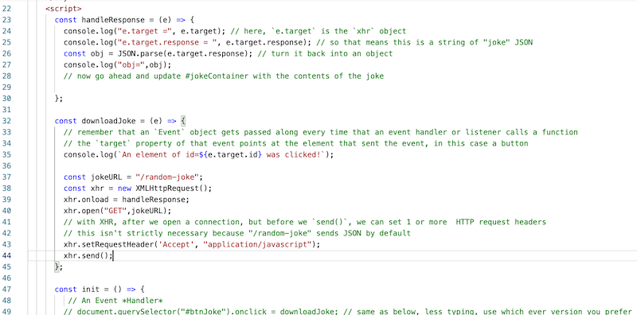

# Checkoff - Random Jokes Plus an Ajax Client


## I.Overview

- We are going to add a simple `XHR` driven client page to your completed [HW - Random Jokes Plus - Phase 4](https://github.com/tonethar/IGME-430-Spring-2021/blob/main/hw-notes/HW-random-jokes-plus.md#phase4)
- You have worked with XHR and web services in both IGME-230/235 & IGME-330 - so this should be really easy for you
- This will also help with project 1!

<hr>

## II. Serving *joke-client.html*

- Save **joke-client.html** (see below fro start file) into the **client** folder of your **random-jokes-plus** (or whatever you called it) folder
- In your **src/htmlResponses.js** file:
  - use `fs` to load the **joke-client.html** file in 
  - create a response handling function to "serve" the file
  - "export" the response handling function
- In **index.js** - add an endpoint for **joke-client.html**
- Lastly, add a hypertext link to **client/error.html** that leads to **joke-client.html**
- Test your **joke-client.html** endpoint both in the location bar of the browser, and by clicking the hypertext link you just created
- You should see the following:

<hr>


<hr>

### II-A. Start File


**joke-client.html**

```html
<html>
  <head>
    <title>Joke Client</title>
    <link href="default-styles.css" type="text/css" rel="stylesheet" />
    <style>
      header{
        background-color:pink;
        color: yellow;
        font-size:2em;
        padding:1em;
      }
      
      h1{
        font-family: fantasy;
        filter: drop-shadow(5px 5px 2px #4444dd);
      }
      
      section{
        border-bottom:1px dashed gray;
      }
    </style>
    <script>
      const downloadJoke = (e) => {
        // remember that an `Event` object gets passed along every time that an event handler or listener calls a function
        // the `target` property of that event points at the element that sent the event, in this case a button
        console.log(`An element of id=${e.target.id} was clicked!`);
      }
      
      const init = () => {
         // An Event *Handler*
        // document.querySelector("#btnJoke").onclick = downloadJoke; // same as below, less typing, use which ever version you prefer
      
        // An Event *Listener*
        document.querySelector("#btnJoke").addEventListener("click", downloadJoke);
      
        // **Actually, event handlers and listeners are NOT exactly the same in all use cases - what ARE the differences?**
      }
      
      window.onload = init;
     
    </script>
  </head>
  <body>
    <header>
      <h1>Are you ready to LAUGH?</h1>
    </header>
    
    <section>
      <h2>Just have time for one joke?</h2>
      <p><button id="btnJoke">Show me a Joke!</button></p>
      <div id="jokeContainer">
        
      </div>
    </section>
    
    <section>
      <h2>How about 5 jokes?</h2>
      <p><button>Show me 5 Jokes!</button></p>
    </section>
    
  </body>
</html>
```

## III. Get *joke-client.html* working

- Here's some `XHR` start code for you - add this to `downloadJoke()`



- test this by clicking the **Show me a Joke!** button - you should see a log to the console that the data has loaded
  - now write JS so that the joke shows up in the `#jokeContainer` div (see below)
- also get the **Show me 5 Jokes!** button working (see below)

<hr>


## IV. Submission

