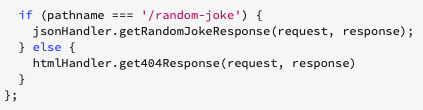
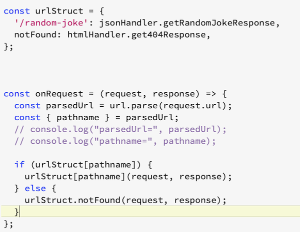
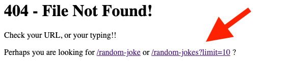
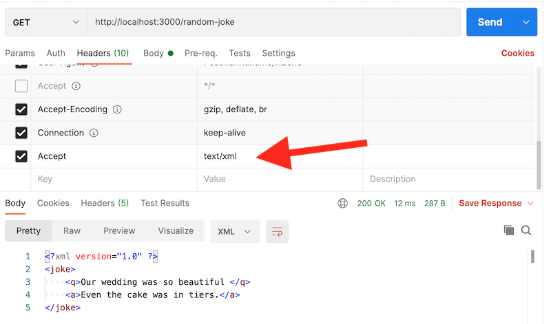
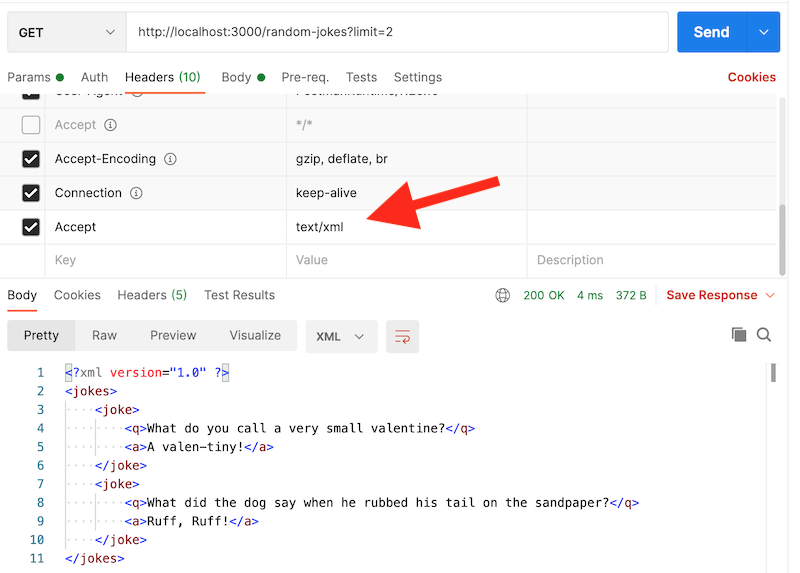
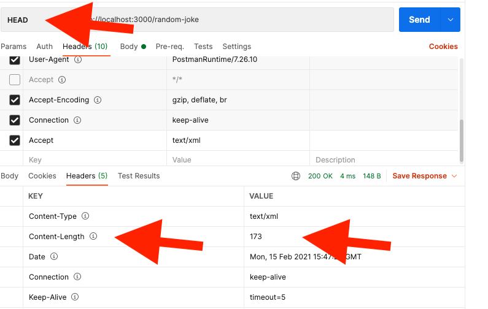
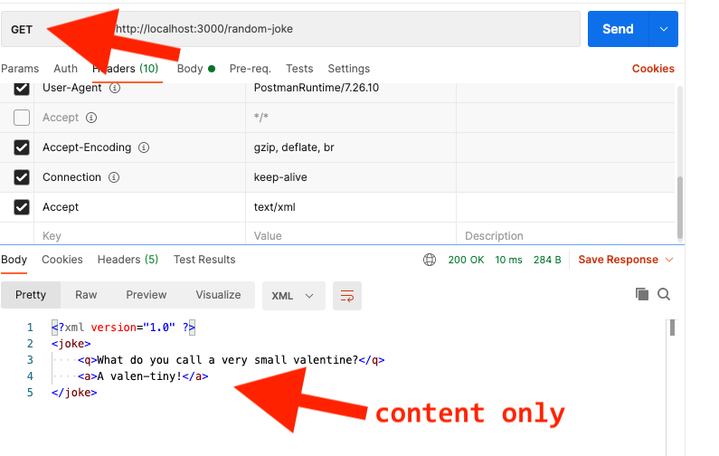

# Homework - Random Jokes Plus

## I. Overview
- In this HW assignment you will add substantial capability to your **random-joke** app
- This will take a bit of time, so get started early
- ***This HW will make a great "starter" for project 1, so it will be time well spent!***

### I-A. Navigation

- [Phase #1. - add your own modules](#phase1)

- [Phase #2. - Add a `/random-jokes` endpoint](#phase2)

- [Phase #3. - Send back both XML & JSON](#phase3)

- [Phase #4. - Send back headers only, NOT content,  when `HEAD` requests are made](#phase4)

<hr>
  
## II. Get Started
- Your start code should be where you left off on **random-joke** as of [Random Joke with tooling - checkoff](../checkoff-notes/random-joke-with-tooling-checkoff.md)
  - the above assignment added `nodemon`, `eslint` and CircleCI to your project
- You can work off of your existing GitHib repository and Heroku app, or you can create a new one, it's up to you. If you are going to go "new", you could have:
  - a new GitHub repository named **random-jokes-plus** (which is what we are going to call it in this exercise going forward)
  - a new Heroku app named `abc1234-random-jokes-plus`
  - if you don't remember how to initialize a new GitHub respository, head to [Skill #5 - First Node Web Server](../core-skills/5-first-node-web-server.md) - Part IV.
- Don't forget to `npm run nodemon` rather than `npm start` so that you won't have to re-boot the server all of the time
- Also be sure to run `npm test` on occassion - and whenever you run into an issue with your code - it might flag a problem for you early - that's what it's for:
  - Tip: Because `nodemon` is running in your main terminal window, you can set up a second terminal window to periodically run `npm test`

<hr><hr>

<a id="phase1" />

## III. Phase #1. - add your own modules

1) You are going to create 2 external modules for **random-jokes-plus**, similar to how we did so in  [Skill #11 - Creating CommonJS Code Modules](/core-skills/11-creating-commonjs-code-modules.md) 

    - create **htmlResponses.js**
      - move `const errorPage = ...` into it 
      - create a function named `const get404Response = (request, response) => {...}` and "export" it
      - import **htmlResponses.js** (as `htmlHandler`) into **index.js**
      - call the `htmlHandler.get404Response()` function in the `onRequest` method of **index.js** (in the correct part of the `if`)
    - create **jsonResponses.js**
      - move `jokes` and `getRandomJoke()` into it
      - create a function named `const getRandomJokeResponse = (request, response) => {...}` and "export" it
      - import **jsonResponses.js** (as `jsonHandler`) into **index.js**
      - call the `jsonHandler.getRandomJokeResponse()` function in the `onRequest` method of **index.js** (in the correct part of the `if`)
     - your `if` statement - the one in `onRequest()` - should look something like this:
     
     <hr>
  
     
     
     <hr>
      
    - test both endpoints in a web browser, they should work as before
    
<hr> 

2) Create `urlStruct` and use it
    
    - here you go, see below!
    
     <hr>
  
     
     
     <hr>
     
    - test both endpoints in a web browser, they should work as before

<a id="phase2" />

<hr><hr>

## IV. Phase #2. - Add a `/random-jokes` endpoint
    
- The `/random-jokes` endpoint will return an array of jokes, defaulting at `1`
- The returned data will look like this:

<hr>

- here are example results of a **`/random-jokes?limit=2`** call:

```json
[ 
 {
    "q": "What do you call a very small valentine?",
    "a": "A valen-tiny!"
  },
  {
    "q": "What did the dog say when he rubbed his tail on the sandpaper?",
    "a": "Ruff, Ruff!"
  }
]
```
<hr>

- If a `limit` parameter is also passed in to `/random-jokes`, that will be the number of jokes returned instead:
  - be sure to validate the `limit` parameter so that it is neither too large or to small - it should be constrained to integer values (use `Math.floor()`) between 1 and the `.length` of the `jokes` array, inclusive
  - for help with this, check out how we handled the `max` parameter in the "random number" HW
- Notes:
  - you will probably want to "shuffle" your array of jokes, and then grab the first `limit` number of items
  - if you borrow any array shuffling code from the Internet, be sure to credit your source both in the source code, and in the dropbox comments section
  - another alternative is to use npm's [underscore
](https://www.npmjs.com/package/underscore) package - which has a function named `shuffle()`
- Also, you will need to pass in a `params` object to the "random jokes response handler" - here's what it could look like:

<hr>


    
 <hr>
  
- When you are done, add a working link to the 404 page that references this new endpoint - see below:

<hr>


    
<a id="phase3" />

<hr><hr>


## V. Phase #3. - Send back both XML & JSON
    
- Note: for help with this Phase, see the "Accept Header" demo in myCourses, and other class notes (which also links to a video)
- the default data type returned by both the `/random-joke` and `/random-jokes` endpoints is JSON
- but if the client sends an [HTTP `Accept` header](https://developer.mozilla.org/en-US/docs/Web/HTTP/Headers/Accept) of `text/xml` in the request phase, then the application will return the joke data in XML format, and will send it back with a `content-type` of `text/xml`:
  - make sure that you handle the possibility that the client might not send any `accept` headers. You can easily test this in the Postman app.
- the joke XML data shall be formed like this:

**`/random-joke`**

```xml
<joke>
  <q>What is a frog's favorite outdoor sport?</q>
  <a>Fly Fishing!"</a>
</joke>
```

**`/random-jokes?limit=2`**

```xml
<jokes>
  <joke>
    <q>What is a frog's favorite outdoor sport?</q>
    <a>Fly Fishing!"</a>
  </joke>
  <joke>
    <q>I hate jokes about German sausages...</q>
    <a>They're the wurst!"</a>
  </joke>
</jokes>
```

- **You won't be able to test the XML capablity endpoints from a web browser's location bar (i.e. simply typing th URL in), because the web browser can't send a  `text/xml` `accept` header from there. The solution is either to use some JavaScript like `XMLHttpRequest`, or to utilize the [Postman](https://www.postman.com/downloads/) App (which you should already have installed)**
- **When you test the app endpoints in Postman, and send `text/xml` for an `accept` header, you will see the following:**

<hr>

- **One joke:**



<hr>

- **Multiple jokes:**



### V-A. Hints

1) In `onRequest()`, you need to grab the contents of the HTTP `accept` header that is sent over by the client. The following code snippet will:
  
    - get the contents of `request.headers.accept` (a string), then "split" it into an array of strings, and assign this array to the `acceptedTypes` variable
    - if `acceptedTypes` is `null` or `undefined`, then assign an empty array to it

```js
let acceptedTypes = request.headers.accept && request.headers.accept.split(',');
acceptedTypes = acceptedTypes || [];
```

2) Your JSON response handlers should have a new parameter for this `acceptedTypes` array:

    - ex. - `const getRandomJokeResponse = (request, response, params, acceptedTypes)`
    - and the call it like this over in `onRequest()`:
      - ex. - `urlStruct[pathname](request, response, params, acceptedTypes);`

3) In `getRandomJokeResponse = (request, response, params, acceptedTypes){}`:

    - check to see that "text/xml" is in the `acceptedTypes` array with [`Array.includes()`](https://developer.mozilla.org/en-US/docs/Web/JavaScript/Reference/Global_Objects/Array/includes)
    - if is DOES NOT, return the data in JSON format - and don't forget to send the correct `Content-Type` header!
    - it if DOES, return the data in XML format - and don't forget to send the correct `Content-Type` header!

4) You might want to rename the **jsonResponses.js** file to **responses.js** - because this file is now returning BOTH JSON and XML

- the **"accept-header-example-DONE"** link in myCourses can also give you some ideas on how to structure your XML and JSON


<a id="phase4" />

<hr><hr>
    
## VI. Phase #4. - Send back headers only, NOT content,  when `HEAD` requests are made

### VI-A. Set up the server

- Note: for help with this Phase, see the "HEAD Requests" demo in myCourses, and other class notes (which also links to a video)
- In your `onRequest` handler, write code that looks for the `method` property of the `request` parameter - that would be `request.method`
- If the method is `HEAD`, then you will send back solely the HTTP *headers*, NOT the actual content. The HTTP headers you need to send back are:
  - `Content-Type:`
  - [`Content-Length:`](https://developer.mozilla.org/en-US/docs/Web/HTTP/Headers/Content-Length) (this is in *bytes*)
  - you can calculate the second of these with this utility function:
  
```js
// ALWAYS GIVE CREDIT - in your code comments and documentation
// Source: https://stackoverflow.com/questions/2219526/how-many-bytes-in-a-javascript-string/29955838
// Refactored to an arrow function by ACJ
const getBinarySize = string => Buffer.byteLength(string, 'utf8');
```

- You only need to do this for the endpoints that send back data - `random-joke` and `random-jokes`
- Hint: your JSON response handlers should have a new parameter for this `request.method` string
  - ex. `const getRandomJokeResponse = (request, response, params, acceptedTypes, httpMethod)`
  - and the call it like this over in `onRequest()`:
    - ex. `urlStruct[pathname](request, response, params, acceptedTypes, httpMethod);`
- Once you have this working, you should test this from Postman by specifying the HTTP *method*, see screenshots below

#### VI-A-i. Test the `HEAD` request method

- Below we make a `HEAD` request, and we only get HTTP headers back (look under the **Headers** tab)
- There are 5 headers in this instance, but we only set 2 of them - `Content-Type` and `Content-Length` - the `http` library set the others for us
- Note the value of the `Content-Length` header - that was calculated with the `getBinarySize()` helper function above
- Be sure to test this BOTH with the `Content-Type` being equal to "text/xml" (meaning the returned type is XML) AND with the `Content-Type` not being specified (meaning the returned type is JSON). The JSON will always be smaller than the XML in our "jokes" use case, which means that the `Content-Length` will be less for JSON too

<hr>



<hr>

#### VI-A-ii. Test the `GET` request method

- Below we make a `GET` request (the default from the browser), and we will get both the content and the headers back from the server
- If we look under the **Headers** tab, the `Content-Length` header will be missing (because our code did not send it)

<hr>



<hr>

### VI-B. Re-factor the HTML code

- Sick of hard-coding your HTML into your JavaScript program files? You should be! Let's instead do things the way the **Simple HTTP Server** and **Streaming Media** PDF HW assignments (i.e. the PDFs) did them!
- Going forward, let's put all of the HTML/CSS/JS and image files into external files, and keep them stored in a folder called **client**
- Go ahead and move the HTML from `const errorPage` to an external file named **error.html**, and put that file into the **client** folder
- When the app starts up, you will then use the `fs` module to load the **error.html** file, and store those contents in `errorPage`
- When HTTP requests come in, send the file back as you normally would
- Once you have that working, create an external CSS style sheet, and use it:
  - create **default-styles.css** 
  - add the following to it, minimally (or add your own styles) - `*{font-family: sans-serif;}`
  - `<link>` to this file from **error.html**
  - load it using `fs`, and write a response handler for it
  - add an endpoint for **default-styles.css**:
    - don't forget to send the correct content type - which is `text/css`!
    - don't forget to send the proper status code - which is `200`!

<hr><hr>
