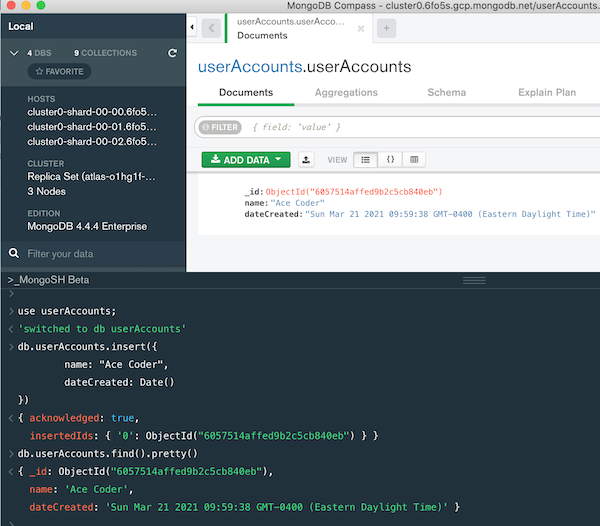

# Week 9A Notes (3/22/21)

## I. Review

- Any questions? about [HW - First Express MVC](../hw-notes/HW-first-express-mvc.md) or the Study Guides?

<hr>

## II. HW that's due soon

- [Express Handlebars Demo](https://github.com/tonethar/IGME-430-Spring-2020/blob/master/notes/express-handlebars-demo.md):
  - This shouldn't take you too long - we already demoed handlebars in class last week 
- [MongoDB - Intro to mongo shell](https://github.com/tonethar/IGME-430-Spring-2020/blob/master/notes/mongo-shell-intro.md):
  - This isn't too hard either, but you need to get your Mongo cloud account set up ASAP - look for the **MongoDBCloudSetup** PDF in myCourses and follow the instructions

<hr>

## III. MongoDB demo

- Pretty much doing this demo covered here (but I will be using MongoDB Compass instead of Terminal) --> [MongoDB - Intro to mongo shell](https://github.com/tonethar/IGME-430-Spring-2020/blob/master/notes/mongo-shell-intro.md)

<a id="in-class-checkoff" />

<hr>

## IV. Attendance Checkoff

- I am putting you into breakout groups (so please help each other out with this!):
  - Everyone needs to get their Mongo cloud account set up (look for the **MongoDBCloudSetup** PDF in myCourses and follow the instructions) 
  - Then complete the following:

1) In the MongoDB Compass application, in the console at the bottom (you will have to click the **\_MongoSH Beta** text/button, type in the following statements, one at a time (make sure that you substitute your actual name for "Ace Coder"):

```js
use userAccounts;

db.userAccounts.insert({
	name: "Ace Coder",
	dateCreated: Date()
})

db.userAccounts.find().pretty()
```

<hr>

2) Take a screenshot of this session - it should look something like this (except with the current date, and with your name instead of "Ace Coder"):



<hr>

3) Upload this screenshot to the dropbox

<hr><hr>

| <-- Previous Unit | Home | Next Unit -->
| --- | --- | --- 
| [**Week 8B Notes**](8B.md)   |  [**IGME-430 Home**](../README.md) | [**Week 9C Notes**](9C.md)
